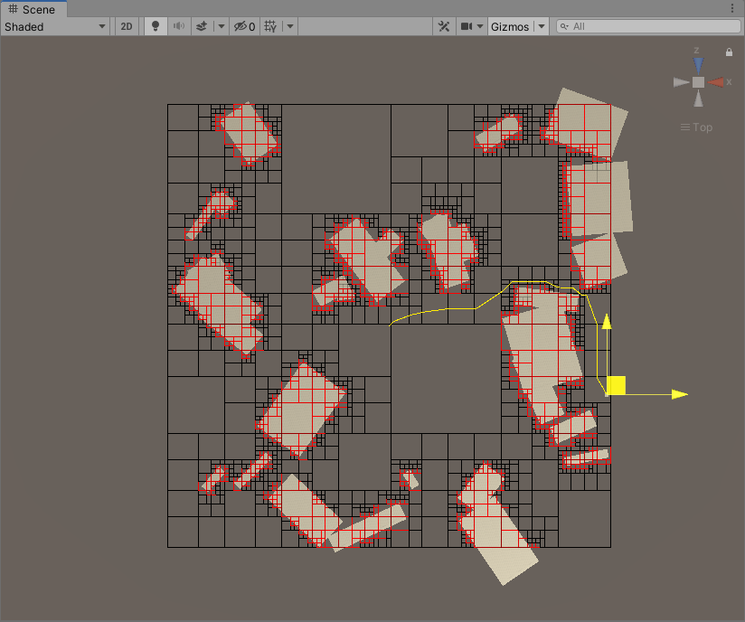

# QuadTreeAStarPathFindingForUnity
unity四叉树+A星寻路
目前支持内容：

  1.动态新增和删除障碍对象
  
  2.A星寻路
  
  3.查询目标点附近障碍（~~目前版本在执行删除操作后不支持该功能~~）
  
  4.查询区域附近空节点



TODO：
  
  1.目前支持的障碍对象只有圆形和矩形，准备以后做扩展
  
  2.优化细分算法
  
  3.优化GC
  
  4.提供多线程的异步方法
  
  ~~5.尝试修改整个结构以兼容burst-compiler（不一定会做...）~~
  
  6.懒操作优化删除方法
   
  7.优化不连通的情况下算法速度很慢的问题
  
  8.添加对NativeQuadTree的Add操作的burst优化，优化NativeQuadTree的A*效率

## QuadTree

```c#
//获取对象池构造出来的所有节点个数总和
//注意一下，这里获得的是对象池构造出来的所有节点，并非当前数据结构中的节点个数，单纯用来估算内存开销。
public int Count{get;}
//构造函数，offset表示障碍物的边缘增幅距离，resolution是地图分辨率
public QuadTree(float offset = 0, float resolution = 2, int initCapital = 1)
//初始化函数，传入的是地图范围
public void Init(Rect rect)
//删除图内指定障碍对象
public void RemoveObject(T obj)
//删除指定区域内的指定障碍对象
public void RemoveObjectInRect(T obj, in float2 min, in float2 max)
//删除指定区域内的所有障碍对象
public void RemoveAllObjectsInRect(in float2 min, in float2 max)
//添加圆形障碍对象（目前是较粗糙的细分）
public void AddCircleObject(T obj, in float radius, in float2 pos)
//添加平行于坐标轴的矩形障碍对象
public void AddParallelRectObject(T obj, in float2 halfSize, in float2 pos)
//添加任意朝向的矩形障碍对象（效率没上面的方法高，所以在平行于坐标轴的情况下尽量用上面的方法）
public void AddRectObject(T obj, in float2 halfSize, in float2 pos, in float2 forward)
//查找和指定区域有重合部分的所有没有障碍对象存在的节点
public void FindNodesWithoutObjects(in int2 min, in int2 max, List<TreeNode<T>> nodes)
//A星寻路，返回从start到end的近似最短路。开启QUAD_TREE_DEBUG后可以在scene视窗下看到寻路路径
public Stack<float2> AStar(float2 start, float2 end)
//查询距离给定位置附近的障碍
public float FindNearObject(float2 pos, out T obj)
//伪清除函数，调用该方法后若再使用该对象需要重新调用Init函数。
public void FakeClear()
//在scene视窗下绘制出四叉树划分的情况。需要开启QUAD_TREE_DEBUG后才能使用
public void Output(float time)

//Example：
public class TestData : IData
{
}
void Case1()
{
    _quadTree = new QuadTree<TestData>(Offset, Resolution);
    _quadTree.Init(new Rect(0, 0, MapSize, MapSize));
    _quadTree.AddCircleObject(new TestData(), radius, in pos);
    _quadTree.AddParallelRectObject(new TestData(), in size, in pos);
    _quadTree.AddRectObject(new TestData(), in size, in pos, forward);
    var distance = _quadTree.FindNearObject(float2.zero, out obj);
    var path = AStar(float2 start, float2 end);
    _quadTree.Output(10);
    _quadTree.FakeClear();
}
```

注：
  
  SimplifyQuadTree是简化后的版本，和非简化版本的主要区别在于该版本没有对障碍物对象的定义但是运行效率更高、内存占用更少。这个版本里面是无法对某种特定的障碍物进行区域增删改的，还有就是这个版本下不据有获取附近障碍物对象的功能。