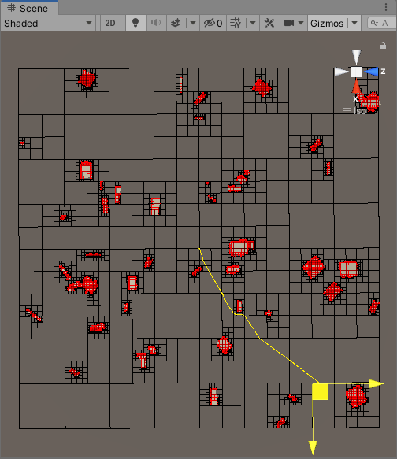

# QuadTreeAStarPathFindingForUnity
unity四叉树+A星寻路
目前支持内容：

  1.动态新增和删除障碍对象
  
  2.A星寻路
  
  3.查询目标点附近障碍（目前版本在执行删除操作后不支持该功能）
  
  4.查询区域附近空节点

TODO：
  
  1.目前支持的障碍对象只有圆形和矩形，准备以后做扩展
  
  2.优化细分算法
  
  3.优化GC
  
  4.提供多线程的异步方法
  
  5.尝试修改整个结构以兼容burst-compiler（不一定会做...）